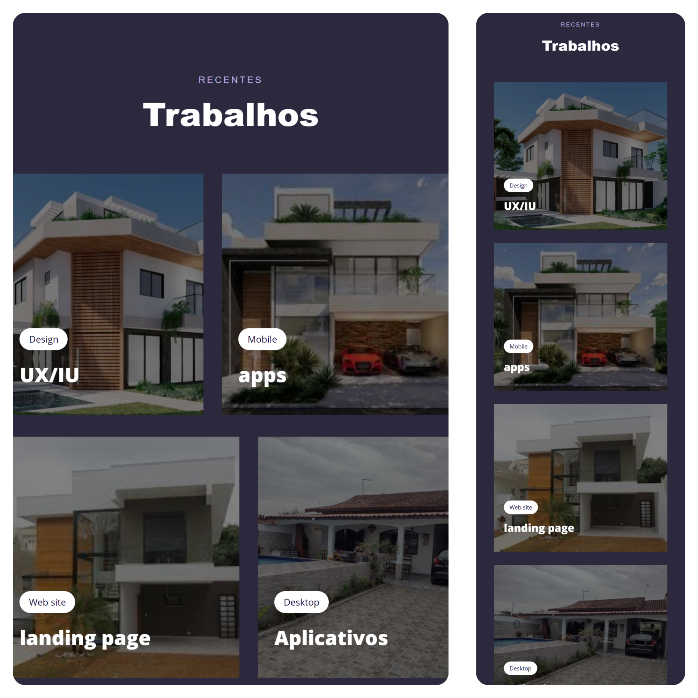

# Page do curso explorer da RocketSeat
    Desktop e Mobile

:link:[Visualizar pagina](https://gabriel6268.github.io/Explorer_PageResponsive/)
>Trabalhando com grid e responsividade.

Page construída no curso explorer da Rockeatseat.
## :wrench: Tecnologias
- HTML 5.
- CSS 3.
- Git e Github.

## :e-mail: Contatos
- gabriel08gomez@gmail.com
- https://www.linkedin.com/in/gabriel-gomes-114b9b169/